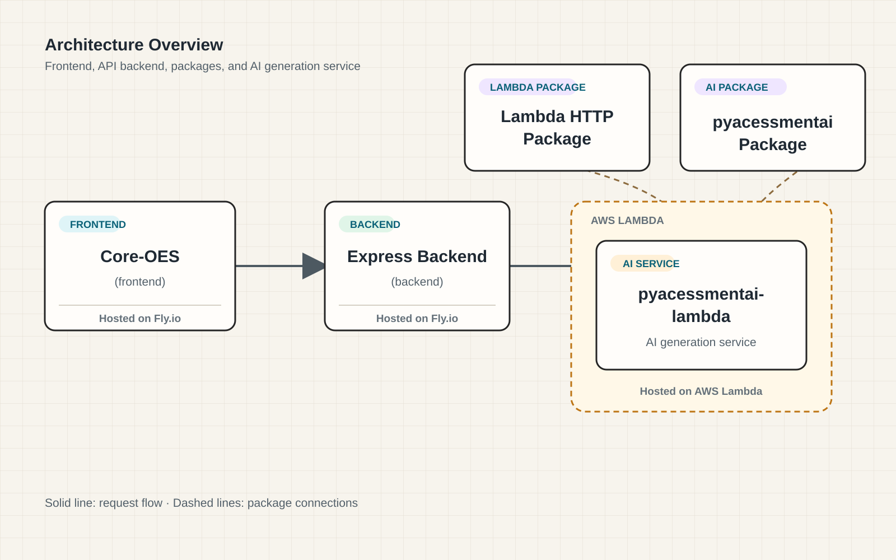

# IMPORTANT

This is a legacy repository and is no longer actively maintained. It is provided for reference only. Please do not use it for new development.

For the latest version of the Online Exercise System, see [core-oes-v2](https://github.com/acessment/acessment-core-oes)

**The above has a much simpler architecture and more powerful features. It is recommended for all new development.**

# Structure



You need 3 parts to get the full system working:
1. The core OES library (this repository)
2. The express backend
3. The python lambda

# Core OES

Core OES is the shared component library and local development workspace for ACEssment's Online Exercise System. The main application for this repository is the Catherine app in `packages/catherine`.

## Quick start

### Prerequisites

- Node.js 20 or later
- pnpm 9 or later

If pnpm is not available, enable it through Corepack:

```bash
corepack enable
corepack prepare pnpm@latest --activate
```

### Run the application

First, copy the environment configuration file and fill in the required values:

```bash
cp .env.catherine.example .env.catherine
```

Then edit `.env.catherine` and fill in all required environment variables.

Run these commands from the repository root:

```bash
pnpm install
pnpm build:generator-panel
pnpm build:lib
pnpm dev:catherine
```

Open http://localhost:3000 in your browser. Stop the server with `Ctrl+C`.

The Catherine app loads its local configuration from the root `.env.catherine` file. It is included for local development. Do not commit production credentials to this file.

## Common commands

Run all commands from the repository root.

| Command | Purpose |
| --- | --- |
| `pnpm dev:catherine` | Start Catherine at http://localhost:3000. |
| `pnpm build:catherine` | Build the Catherine app for production. |
| `pnpm build:generator-panel` | Build the shared `@acessment/generator-panel` library. |
| `pnpm build:lib` | Build the shared `@acessment/core-oes` library. |
| `pnpm build:all:catherine` | Build generator-panel, Core OES, then Catherine. |
| `pnpm lint` | Run linting in every workspace package. |

## Workspace layout

| Path | Description |
| --- | --- |
| `packages/catherine` | Catherine React Router application used for local development. |
| `packages/library` | Shared `@acessment/core-oes` component library. |
| `packages/generator-panel` | Shared generator panel library used by Core OES. |
| `.env.catherine` | Local environment configuration loaded by Catherine. |

## Troubleshooting

### `pnpm` is not recognized

Install a supported Node.js version and run:

```bash
corepack enable
corepack prepare pnpm@latest --activate
```

Close and reopen the terminal before retrying `pnpm install`.

### Dependencies or generated files are out of date

Reinstall dependencies and rebuild the shared library:

```bash
pnpm install
pnpm build:generator-panel
pnpm build:lib
```

Then start the application again:

```bash
pnpm dev:catherine
```

### Port 3000 is already in use

Stop the process using port `3000`, then rerun `pnpm dev:catherine`.

## Working on the shared library

The Catherine app resolves `@acessment/core-oes` to `packages/library/src` during local development. Changes there are picked up by the dev server. Before checking a production build, run:

```bash
pnpm build:all:catherine
```